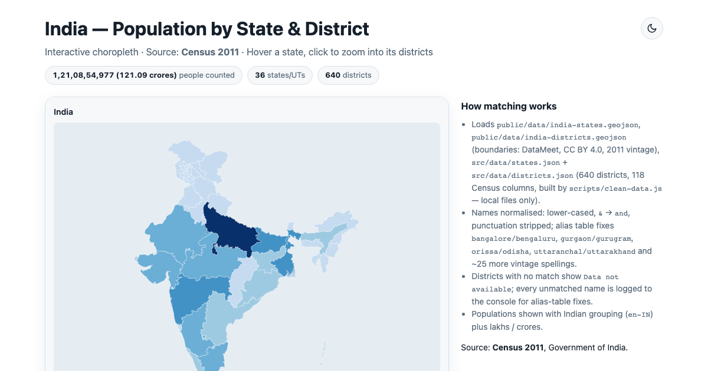
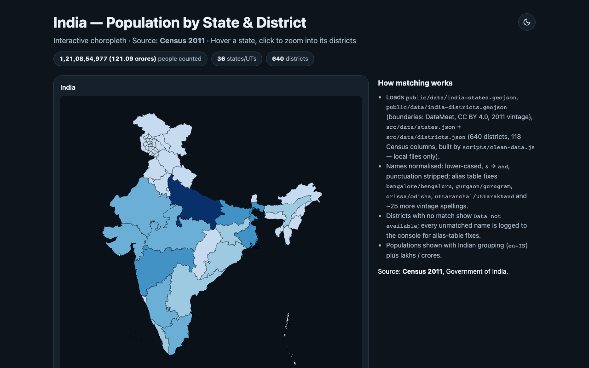
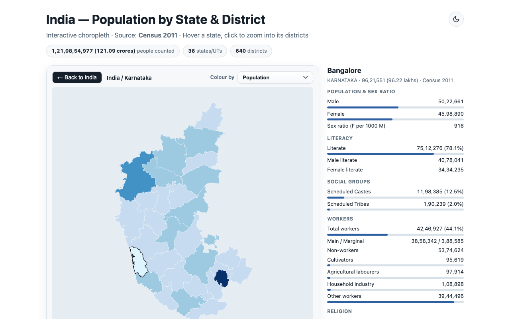
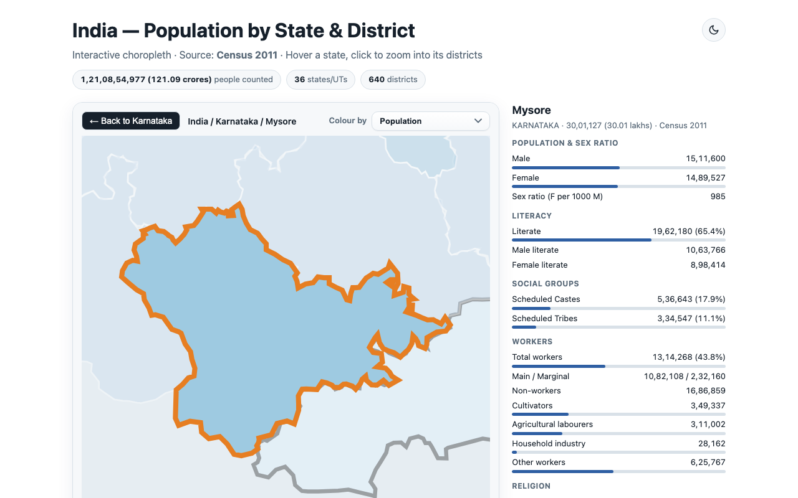

# India — Population by State & District (Census 2011)

Interactive choropleth of India with state → district drill-down. Plain HTML/CSS/JS plus
locally installed `d3` — no CDN, no API calls. All data files are local.



🎬 [Watch the demo tour](docs/demo.webm) · Click a state to zoom into its districts,
click a district to focus it, recolor by literacy / sex ratio / electricity.

| India (dark) | Districts | District focus |
|---|---|---|
|  |  |  |

## Run

```bash
npm install
npm run clean-data   # rebuild src/data/districts.json from the raw CSV
npx serve . -l 8080  # or: python3 -m http.server 8080
```

Open `http://localhost:8080/`. (`file://` won't work — the app fetches local data files.)

## Test

```bash
npm run test:e2e      # 9 Playwright tests: views, drill-down, dropdown, theme, fallback, locality
node scripts/capture-assets.mjs http://localhost:8080  # regenerate docs/ screenshots + demo
```

The suite also asserts the page makes **zero external network requests**.

## SEO

Single-page SEO included: title, meta description/keywords, Open Graph + Twitter cards
(`docs/og-image.png`), JSON-LD (`WebApplication` + Census `Dataset`), SVG favicon,
`robots.txt`, and `sitemap.xml` (replace the placeholder domain on deploy).

## Data

| File | What |
|---|---|
| `public/data/india-states.geojson` | State boundaries (GADM vintage; J&K north restored from districts) |
| `public/data/india-districts.geojson` | 641 district shapes, converted from DataMeet `Districts/Census_2011` (CC BY 4.0), simplified |
| `src/data/states.json` | State populations, Census 2011 |
| `src/data/districts.json` | 640 districts × 118 Census columns, built by `scripts/clean-data.js` |
| `india-districts-census-2011.csv` | Raw Census source for the script above |

Names are matched after lower-casing, `&` → `and`, punctuation stripping, plus an alias
table (`bangalore/bengaluru`, `orissa/odisha`, …). Unmatched districts show
“Data not available” and are logged to the console. Run `node scripts/clean-data.js`
to print the full GeoJSON ↔ CSV mismatch report.
